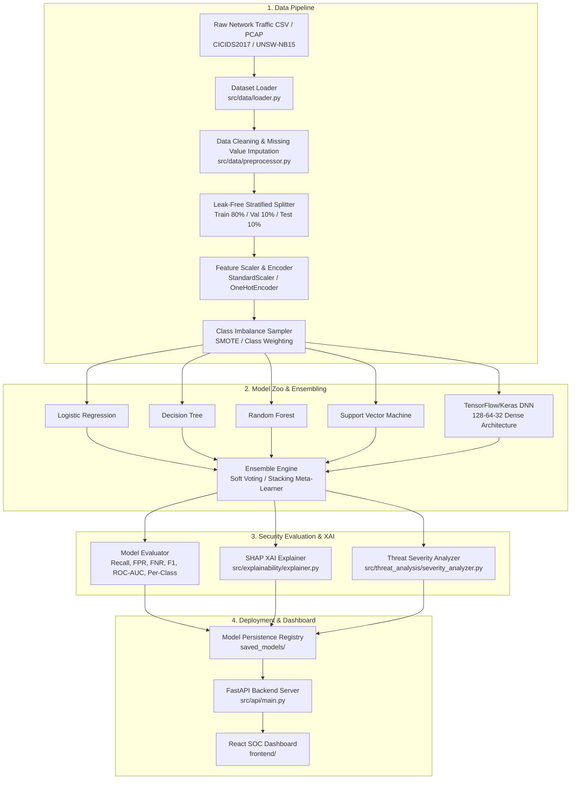

# Intelligent Network Intrusion Detection & Threat Analysis

[](https://www.python.org/)
[](https://www.tensorflow.org/)
[](https://fastapi.tiangolo.com/)
[](https://reactjs.org/)
[](LICENSE)

An end-to-end Deep Learning & Cybersecurity system designed to analyze network flow data, detect intrusion attempts, perform threat severity evaluation, and deliver explainable AI insights via a high-performance FastAPI backend and React frontend dashboard.

---

## Executive Summary & System Overview

Network Intrusion Detection Systems (NIDS) are critical defense mechanisms in modern cybersecurity infrastructure. Traditional signature-based detection systems fail against novel zero-day exploits and high-volume, dynamic network traffic.

This project implements an **Intelligent Network Intrusion Detection System** combining:
1. **Traditional Machine Learning Baselines** (Logistic Regression, Decision Tree, Random Forest, SVM).
2. **Deep Neural Networks (DNN)** built with TensorFlow/Keras with batch normalization and dropout regularization.
3. **Ensemble Learning** (Soft Voting & Meta-Learner Stacking) objectively benchmarked against individual models.
4. **Explainable AI (XAI)** powered by SHAP to explain feature contributions for suspicious network flows.
5. **Threat Severity Analysis Engine** that explicitly decouples **Model Statistical Confidence** from **Operational Threat Severity**.

---

## High-Level System Architecture



---

## Deep Neural Network (DNN) Architecture

The core deep learning model is built using TensorFlow/Keras with a modular architecture supporting both **Binary Classification** (Attack vs. Benign) and **Multiclass Classification** (DoS, DDoS, PortScan, Bot, Infiltration, Brute Force, Web Attack, Benign).

```
   Input Layer (K Features)
             │
   Dense (128 units, ReLU)
             │
     Batch Normalization
             │
      Dropout (rate=0.3)
             │
   Dense (64 units, ReLU)
             │
     Batch Normalization
             │
      Dropout (rate=0.3)
             │
   Dense (32 units, ReLU)
             │
       Output Layer
  ┌──────────┴──────────┐
Binary:               Multiclass:
Dense(1, Sigmoid)     Dense(N, Softmax)
```

---

## Threat Severity vs. Model Confidence

A key requirement in cybersecurity operations is distinguishing **Model Confidence** from **Threat Severity**:

- **Model Confidence**: The statistical probability score $[0.0 - 1.0]$ output by the model classifier.
- **Threat Severity**: The operational security risk rating (`NORMAL`, `LOW`, `MEDIUM`, `HIGH`, `CRITICAL`) assigned based on attack type potential impact regardless of raw prediction certainty.

### Threat Matrix Logic

| Predicted Category | Statistical Confidence | Operational Threat Severity | SOC Action Protocol |
|---|---|---|---|
| **BENIGN** | Any ($\ge 0.50$) | `NORMAL` | Log & Pass Flow |
| **PortScan** | High ($\ge 0.85$) | `MEDIUM` | Flag IP for Reconnaissance Monitoring |
| **DoS / DDoS** | High ($\ge 0.85$) | `HIGH` | Trigger Rate Limiting & Firewall Filter |
| **Infiltration / Ransomware** | Low ($0.50 - 0.65$) | `CRITICAL` (Escalated) | Immediate Security Operations Center Alert |
| **Infiltration / Ransomware** | High ($\ge 0.85$) | `CRITICAL` | Automatic Host Isolation & Incident Response |

---

## Repository Directory Structure

```text
intelligent-network-intrusion-detection/
├── .gitignore               # Comprehensive Git ignore for Python, ML, Jupyter, React
├── requirements.txt         # Core dependencies (TensorFlow, PyYAML, FastAPI, SHAP, etc.)
├── README.md                # Main project documentation & architecture guide
├── PROJECT_PLAN.md          # Phased 11-step course implementation plan
├── configs/                 # System and model configuration files
│   └── config.yaml          # Central YAML configuration (paths, hyperparams, thresholds)
├── data/                    # Dataset directory (git-ignored except .gitkeep)
│   ├── raw/                 # Ingested raw network flow dataset CSVs/PCAPs
│   ├── processed/           # Scaled, encoded, preprocessed dataset splits
│   └── sample/              # Lightweight sample datasets for rapid debugging
├── notebooks/               # Experimental Jupyter notebooks
│   ├── README.md            # Notebook directory index & execution sequence
│   ├── 01_eda.ipynb         # Exploratory Data Analysis & visual analytics
│   ├── 02_preprocessing.ipynb # Scaling & class imbalance experimentation
│   ├── 03_baselines.ipynb   # Baseline ML model tuning
│   ├── 04_dnn_model.ipynb   # TensorFlow/Keras DNN training & callbacks
│   ├── 05_ensemble.ipynb    # Soft voting vs. Stacking ensemble study
│   └── 06_xai_shap.ipynb    # SHAP explainable AI visualizations
├── reports/                 # Output metrics and generated visualization figures
│   ├── figures/             # Confusion matrices, ROC curves, SHAP summary plots
│   └── metrics/             # Exported JSON metric reports
├── saved_models/            # Serialized model binaries & preprocessors (git-ignored)
├── src/                     # Core production Python package
│   ├── __init__.py
│   ├── utils/               # Utilities (logger, seed setter, config loader)
│   │   ├── __init__.py
│   │   ├── config_loader.py
│   │   ├── logger.py
│   │   └── seed.py
│   ├── data/                # Ingestion, cleaning, splitting, preprocessors, sampler
│   │   ├── __init__.py
│   │   ├── loader.py
│   │   ├── preprocessor.py
│   │   └── sampler.py
│   ├── features/            # Feature engineering & statistical selection
│   │   ├── __init__.py
│   │   ├── engineering.py
│   │   └── selection.py
│   ├── models/              # Baselines, DNN, Ensemble, and Registry
│   │   ├── __init__.py
│   │   ├── baselines.py
│   │   ├── dnn.py
│   │   ├── ensemble.py
│   │   └── registry.py
│   ├── evaluation/          # Security evaluation framework & visualizers
│   │   ├── __init__.py
│   │   ├── metrics.py
│   │   └── visualizer.py
│   ├── explainability/      # SHAP Explainable AI pipeline
│   │   ├── __init__.py
│   │   └── explainer.py
│   ├── threat_analysis/     # Operational threat severity analyzer
│   │   ├── __init__.py
│   │   └── severity_analyzer.py
│   └── api/                 # FastAPI backend application
│       ├── __init__.py
│       ├── main.py
│       └── schemas.py
└── frontend/                # React security dashboard frontend
    └── README.md            # Frontend roadmap & components guide
```

---

## Quickstart & Setup Guide

### 1. Environment Preparation

Clone the repository and create a Python virtual environment:

```bash
# Create virtual environment
python -m venv .venv

# Activate virtual environment (Windows PowerShell)
.venv\Scripts\Activate.ps1

# Activate virtual environment (Linux/macOS)
source .venv/bin/activate
```

### 2. Install Dependencies

```bash
pip install --upgrade pip
pip install -r requirements.txt
```

### 3. Configuration Management

All dataset paths, preprocessing parameters, model hyperparameters, and threat mapping rules are configured in `configs/config.yaml`.

To test with custom datasets (e.g. CICIDS2017 or UNSW-NB15), simply update `configs/config.yaml`:

```yaml
data:
  dataset_name: "CICIDS2017"
  raw_data_path: "data/raw/dataset.csv"
  target_column: "Label"
  classification_mode: "multiclass"
```

### 4. Running the Backend REST API

```bash
uvicorn src.api.main:app --reload --host 0.0.0.0 --port 8000
```

Access the interactive API documentation at:
- Swagger UI: [http://localhost:8000/docs](http://localhost:8000/docs)
- ReDoc: [http://localhost:8000/redoc](http://localhost:8000/redoc)

---

## Principles & Best Practices

- **Zero Data Leakage**: All scalers, encoders, and imbalance handlers are fitted strictly on training data split before transforming validation/test sets.
- **Reproducibility**: Random seed parameters are centrally configured (`src/utils/seed.py`) across Python, NumPy, and TensorFlow.
- **No Hardcoded Features**: Feature processing routines adapt dynamically to dataset schemas passed via YAML configurations.
- **Recall & False Negative Priority**: Evaluation metrics specifically prioritize high Recall and low False Negative Rates (FNR) to prevent undetected malicious intrusion.